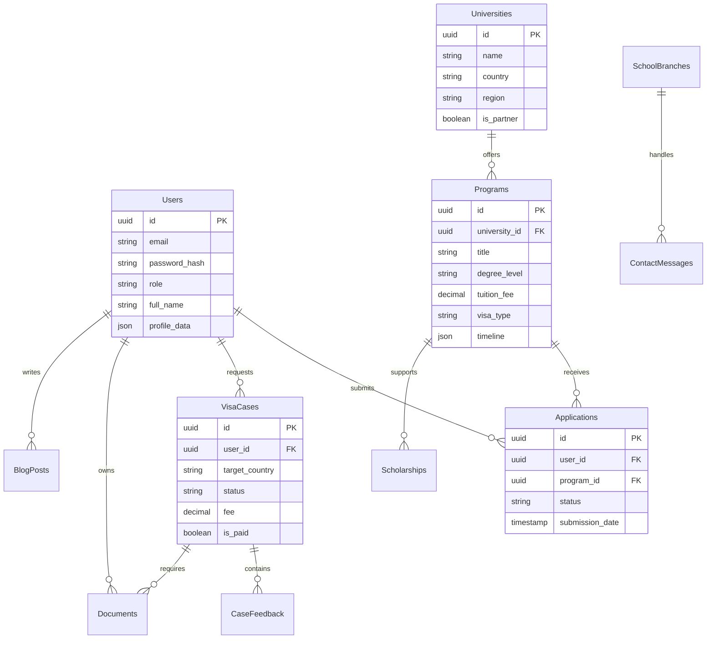

# EduBridge Database Schema Design

This document outlines the proposed database schema for the EduBridge platform, designed based on the existing frontend data structures and feature requirements.

## Overview

The database is designed around these core domains:
1.  **User Management**: Students, Admins, and Partners.
2.  **Academic Programs & Universities**: The core catalog of offerings.
3.  **Applications & Visa Processing**: Tracking student progress.
4.  **Content Management**: Blogs, Resources, Testimonials.
5.  **Organization**: Branches and structural data.

## Entity-Relationship Diagram (ERD)

## Detailed Schema Definitions

### 1. User Management

#### `users`
Stores all system users including students, admins, and university partners.
- **`id`** (`UUID`, PK): Unique identifier.
- **`email`** (`VARCHAR(255)`, Unique): User's email address.
- **`password_hash`** (`VARCHAR(255)`): Hashed password (e.g., bcrypt).
- **`full_name`** (`VARCHAR(100)`): User's full display name.
- **`role`** (`ENUM('student', 'admin', 'partner', 'editor')`, Default: `'student'`): Authorization level.
- **`avatar_url`** (`VARCHAR(500)`): Link to profile picture.
- **`google_id`** (`VARCHAR(255)`, Nullable): For OAuth integration.
- **`phone_number`** (`VARCHAR(20)`): Contact number.
- **`is_active`** (`BOOLEAN`, Default: `true`): Soft delete/ban status.
- **`created_at`** (`TIMESTAMP`, Default: `NOW()`): Account creation time.
- **`last_login`** (`TIMESTAMP`): Audit user activity.

### 2. Academic Catalog

#### `universities`
Institutions that offer programs. Can be partners or general listings.
- **`id`** (`UUID`, PK): Unique identifier.
- **`name`** (`VARCHAR(255)`): University name.
- **`slug`** (`VARCHAR(255)`, Unique): URL-friendly name.
- **`country`** (`VARCHAR(100)`): Location country (e.g., 'South Korea').
- **`city`** (`VARCHAR(100)`): City location.
- **`region`** (`VARCHAR(50)`): Continent/Region (e.g., 'Asia', 'Europe').
- **`description`** (`TEXT`): Overview of the institution.
- **`logo_url`** (`VARCHAR(500)`): University logo.
- **`hero_image_url`** (`VARCHAR(500)`): Cover image for detailed pages.
- **`website_url`** (`VARCHAR(500)`): Official university website.
- **`is_partner`** (`BOOLEAN`, Default: `false`): Highlights promoted institutions.
- **`ranking`** (`INTEGER`, Nullable): Global or local ranking.

#### `programs`
Specific courses or degrees offered by a university.
- **`id`** (`UUID`, PK): Unique identifier.
- **`university_id`** (`UUID`, FK -> `universities.id`): Parent institution.
- **`title`** (`VARCHAR(255)`): Program name (e.g., 'BSc Computer Science').
- **`degree_level`** (`ENUM('Bachelor', 'Master', 'PhD', 'Language', 'Associate')`): Level of study.
- **`field_of_study`** (`VARCHAR(100)`): Department or Major (e.g., 'Engineering').
- **`description`** (`TEXT`): Detailed program information.
- **`tuition_fee`** (`DECIMAL(10, 2)`): Cost per year/semester.
- **`currency`** (`VARCHAR(3)`, Default: `'USD'`): Currency code.
- **`duration_months`** (`INTEGER`): Length of the program.
- **`start_date`** (`DATE`): Next intake start.
- **`application_deadline`** (`DATE`): Cutoff for applications.
- **`instruction_language`** (`VARCHAR(50)`, Default: `'English'`): Language of teaching.
- **`visa_type_required`** (`VARCHAR(50)`): Associated visa (e.g., 'D-2').
- **`status`** (`ENUM('open', 'closed', 'waitlist')`): Enrollment status.
- **`tags`** (`JSONB`): Array of tags (e.g., `['scholarship', 'best-seller']`).
- **`timeline`** (`JSONB`): structured dates for application steps (e.g., `[{ "step": "Interview", "date": "2024-05-01" }]`).

#### `scholarships`
Financial aid opportunities linked to programs or general.
- **`id`** (`UUID`, PK): Unique identifier.
- **`program_id`** (`UUID`, FK -> `programs.id`, Nullable): If linked to a specific program.
- **`title`** (`VARCHAR(255)`): Scholarship name.
- **`provider`** (`VARCHAR(255)`): Who offers it (if not the university).
- **`amount_description`** (`VARCHAR(255)`): Text describing value (e.g., 'Full Tuition + Stipend').
- **`deadline`** (`DATE`): Application limit.
- **`eligibility_criteria`** (`TEXT`): Requirements summary.
- **`type`** (`ENUM('merit', 'diversity', 'need-based', 'regional')`): Category.

### 3. Student Services (The "Business" Logic)

#### `applications`
Direct applications to university programs.
- **`id`** (`UUID`, PK): Unique identifier.
- **`user_id`** (`UUID`, FK -> `users.id`): The applicant.
- **`program_id`** (`UUID`, FK -> `programs.id`): The target program.
- **`status`** (`ENUM('draft', 'submitted', 'under_review', 'interview', 'accepted', 'rejected')`): Implementation state.
- **`submission_date`** (`TIMESTAMP`): When it was sent.
- **`internal_notes`** (`TEXT`): Admin comments (not visible to user).
- **`documents_url`** (`JSONB`): References to submitted files.

#### `visa_cases`
Consultation and processing for travel documents.
- **`id`** (`UUID`, PK): Unique identifier.
- **`user_id`** (`UUID`, FK -> `users.id`): The client.
- **`target_country`** (`VARCHAR(100)`): Destination (e.g., 'Canada').
- **`visa_type`** (`VARCHAR(50)`): (e.g., 'Student Visa', 'Work Permit').
- **`status`** (`ENUM('new', 'consultation_booked', 'docs_collection', 'submitted', 'approved', 'rejected')`): Pipeline stage.
- **`consultation_fee`** (`DECIMAL(10, 2)`): Cost for service.
- **`is_paid`** (`BOOLEAN`, Default: `false`): Payment status.
- **`assigned_agent_id`** (`UUID`, FK -> `users.id`, Nullable): Staff managing the case.
- **`meeting_date`** (`TIMESTAMP`, Nullable): Scheduled consultation time.
- **`meeting_link`** (`VARCHAR(500)`, Nullable): Zoom/Google Meet URL.

#### `case_feedback`
Communication within a visa case.
- **`id`** (`UUID`, PK): Unique identifier.
- **`case_id`** (`UUID`, FK -> `visa_cases.id`): Parent case.
- **`sender_id`** (`UUID`, FK -> `users.id`): Author (Admin or User).
- **`message`** (`TEXT`): Content.
- **`type`** (`ENUM('message', 'status_change', 'document_request')`): Context.
- **`created_at`** (`TIMESTAMP`): Time sent.
- **`is_read`** (`BOOLEAN`, Default: `false`): Notification status.

#### `documents`
Centralized file storage references.
- **`id`** (`UUID`, PK): Unique identifier.
- **`user_id`** (`UUID`, FK -> `users.id`): Owner.
- **`entity_type`** (`ENUM('application', 'visa_case', 'user_profile')`): Context.
- **`entity_id`** (`UUID`): ID of the related record.
- **`file_url`** (`VARCHAR(500)`): Path to file (e.g., S3/Cloudinary URL).
- **`file_name`** (`VARCHAR(255)`): Original filename.
- **`file_type`** (`VARCHAR(50)`): MIME type (e.g., 'application/pdf').
- **`file_size_bytes`** (`BIGINT`): Size handling.
- **`verification_status`** (`ENUM('pending', 'verified', 'rejected')`): Admin check.

### 4. Content Management System (CMS)

#### `blog_posts`
Articles and news.
- **`id`** (`UUID`, PK): Unique identifier.
- **`title`** (`VARCHAR(255)`): Headline.
- **`slug`** (`VARCHAR(255)`, Unique): URL path.
- **`content`** (`TEXT`): Markdown or HTML body.
- **`excerpt`** (`VARCHAR(500)`): Summary for cards.
- **`cover_image_url`** (`VARCHAR(500)`): Thumbnail.
- **`author_id`** (`UUID`, FK -> `users.id`): Link to admin profile.
- **`category`** (`VARCHAR(50)`): Filtering tag.
- **`is_published`** (`BOOLEAN`, Default: `false`): Draft status.
- **`published_at`** (`TIMESTAMP`): Release date.

#### `library_resources`
Downloadable content (PDFs, E-books).
- **`id`** (`UUID`, PK): Unique identifier.
- **`title`** (`VARCHAR(255)`): Resource name.
- **`type`** (`ENUM('ebook', 'journal', 'guide', 'paper')`): Format.
- **`author`** (`VARCHAR(100)`): Content creator.
- **`file_url`** (`VARCHAR(500)`): Download link.
- **`access_level`** (`ENUM('public', 'registered', 'premium')`): Gating logic.

#### `testimonials`
Student success stories.
- **`id`** (`UUID`, PK): Unique identifier.
- **`student_name`** (`VARCHAR(100)`): Name shown.
- **`university_name`** (`VARCHAR(255)`): Where they went.
- **`program`** (`VARCHAR(100)`): What they studied.
- **`quote`** (`TEXT`): The testimony.
- **`image_url`** (`VARCHAR(500)`): Student photo.
- **`video_url`** (`VARCHAR(500)`, Nullable): Optional video link.

### 5. Meta & Config

#### `branches`
Physical office locations.
- **`id`** (`UUID`, PK): Unique identifier.
- **`name`** (`VARCHAR(100)`): Branch name (e.g., 'Nairobi HQ').
- **`country`** (`VARCHAR(100)`): Location.
- **`address`** (`TEXT`): Full physical address.
- **`contact_email`** (`VARCHAR(255)`): Branch specific email.
- **`manager_name`** (`VARCHAR(100)`): Person in charge.
- **`coordinates`** (`POINT`): For map integration.

## Implementation Notes

1.  **UUIDs**: Use UUID v4 for all primary keys to ensure global uniqueness and security (harder to guess than auto-increment integers).
2.  **JSON Columns**: Attributes like `timeline` in Programs or `profile_data` in Users are best stored as JSONB to allow flexibility without altering the schema for every minor field change.
3.  **Timestamps**: Every table should inherently have `created_at` and `updated_at` (omitted in some definitions above for brevity but assumed).
4.  **Files**: Do not store binary file data in the database. Store the URL string pointing to an object storage service (like AWS S3 or Cloudinary).
